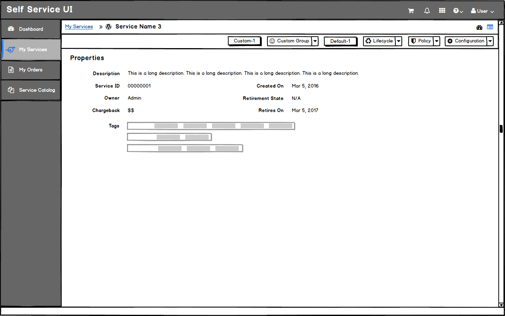
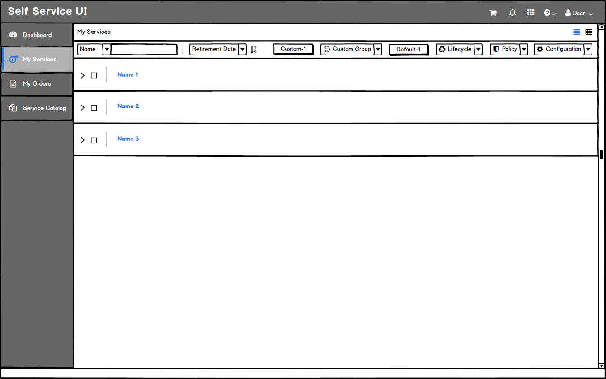
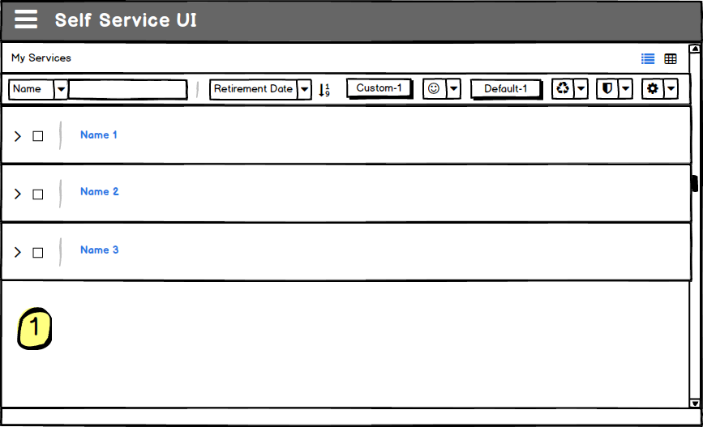
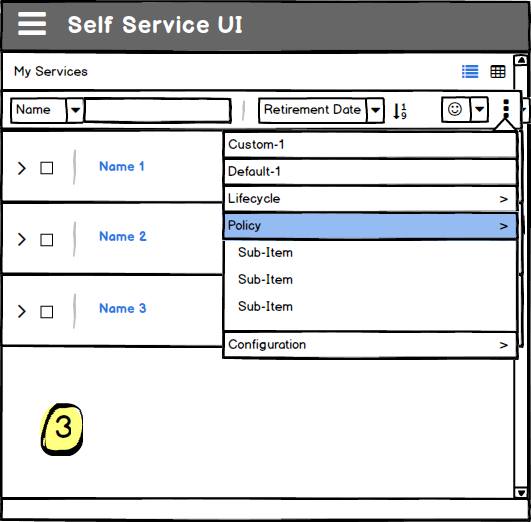

# Button Layout
* Action buttons are found across a bar towards the top of most pages.
* Action buttons may be system generated (default) or may be customized by the user.
* In cases where both system generated and customized buttons exist, they should be presented in the following order from left to right:
  - Default single button
  - Default button group
  - Custom single button
  - Custom button group

* Button bars should span across the entire page and should sit underneath the breadcrumbs bar (if it exists).
* When there is no breadcrumbs bar, the button bar may be at the top of the page.

* When a PF toolbar is being used, the action buttons may share this space with any filter or sort capabilities. This will occur on most list views, card views, and table views.

**NOTE:** Users should be **required** to supply an icon for custom button groups to accommodate for collapsing to an icon only view when needed.

## Responsive States
* When space becomes an issue, action buttons should be condensed to accommodate.
* Accommodations should be made in the following sequence:
  - **Step 1:** Remove labels from ALL button groups (default and custom)
  - **Step 2:** Group all standalone buttons in a kebab. Left most buttons should be placed at the top of the list inside the kebab.
  - **Step 3:** Starting with the right most button group, add button groups one at a time to the kebab menu. Change this menu to a dropdown accordion that can handle secondary menu items.

  
