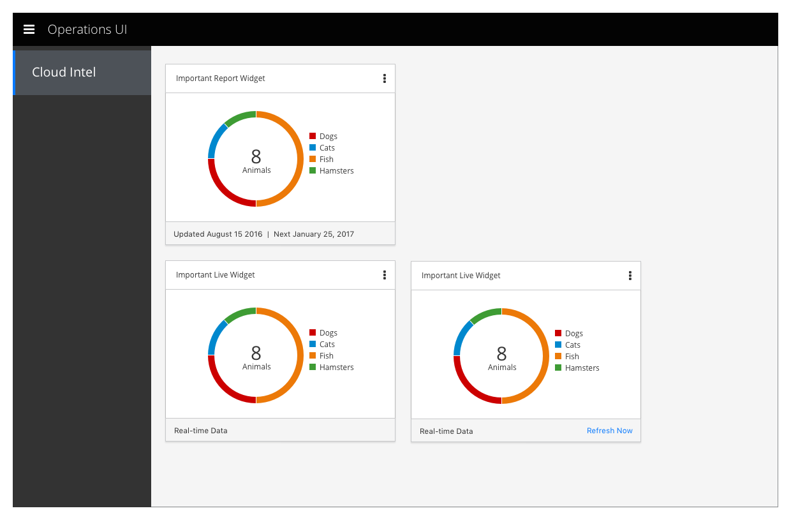

# Hybrid Dashboard

- Hybrid Dashboards can exist in multiple places
- They are available to all users
- This area is provided so that users can quickly view important information from a mixture of report-based and real-time sources

## View Dashboard

### Dashboard Cards

- Report-based cards should remain as they currently are.
- Cards based on real-time data should replace the note in the lower left corner with the phrase "Real-time Data"
- If a real-time card still needs to make requests or check for new data periodically rather than "push" updating, the card should include a button to refresh on command.

## Customer Feedback

### Customer Feedback Received
  - Overview of customer feedback received

### Necessary Customer Feedback
  - Questions to follow up with customers
