# Ansible
The following low fidelity mockups depict the initial designs of ansible integration.

Ansible is a secondary navigation item under Automation.

Ansible has three tertiary navigation items:
1. [Credentials](ansible#ansible-repositories)
1. [Playbooks](ansible#ansible-playbooks)
1. [Repositories](ansible#ansible-repositories)

## Ansible Credentials
The Credentials page includes:
- **Breadcrumb bar:** Automation > Ansible > Credentials
- **Table view:**
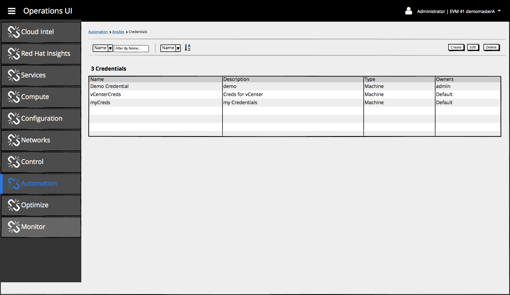

The table includes the following columns:
  - **Name:**
  - **Description:**
  - **Type:**
  - **Owners:**

### Filtering & Sorting
Filtering is supported on the following fields:
- Name (default)
- tbd

Sorting is supporting on the following fields:
- Name (default)
- tbd

### Table Interaction
Clicking on a row should show details of the Credential.

When no repositories exist, use the PatternFly Empty State Pattern
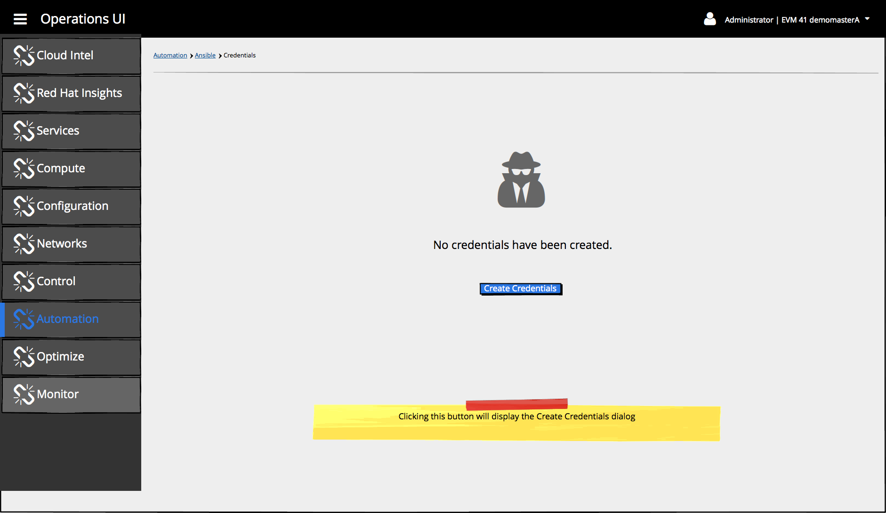

### Available Action Buttons

#### Create Credentials
The following types of credentials can be created:
1. [AWS Cloud Credentials](ansible#aws-cloud-credentials)
1. [Google Compute Engine Cloud Credentials](ansible#google-compute-engine-cloud-credentials)
1. [Microsoft Azure Classic Cloud Credentials](ansible#microsoft-azure-classic-cloud-credentials)
1. [Microsoft Azure Resource Manager Cloud Credentials](ansible#microsoft-azure-resource-manager-cloud-credentials)
1. [OpenStack Cloud Credentials](ansible#openstack-cloud-credentials)
1. [Rackspace Cloud Credentials](ansible#rackspace-cloud-credentials)
1. [Red Hat CloudForms Cloud Credentials](ansible#red-hat-cloudforms-cloud-credentials)
1. [Red Hat Satellite 6 Cloud Credentials](ansible#red-hat-satellite-6-cloud-credentials)
1. [VMware vCenter Cloud Credentials](ansible#vmware vCenter-cloud-redentials)
1. [Machine Credentials](ansible#machine-credentials)
1. [Network Credentials](ansible#network-credentials)

##### AWS Cloud Credentials
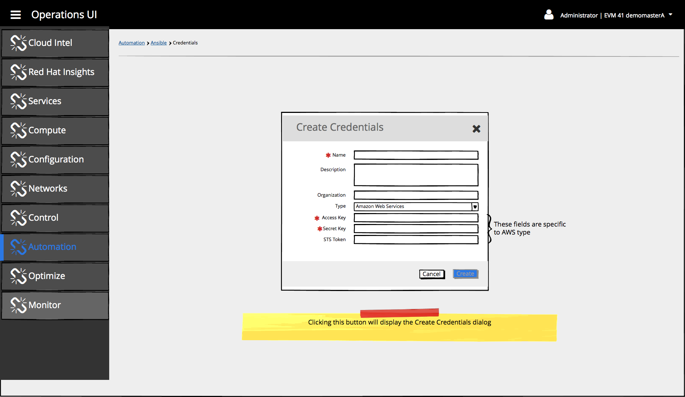

##### Google Compute Engine Cloud Credentials
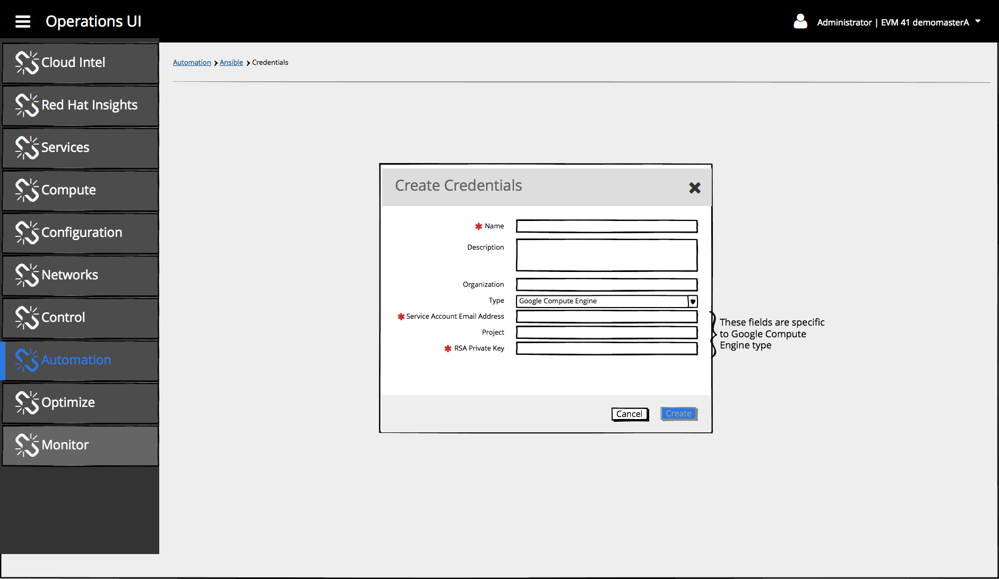

##### Microsoft Azure Classic Cloud Credentials
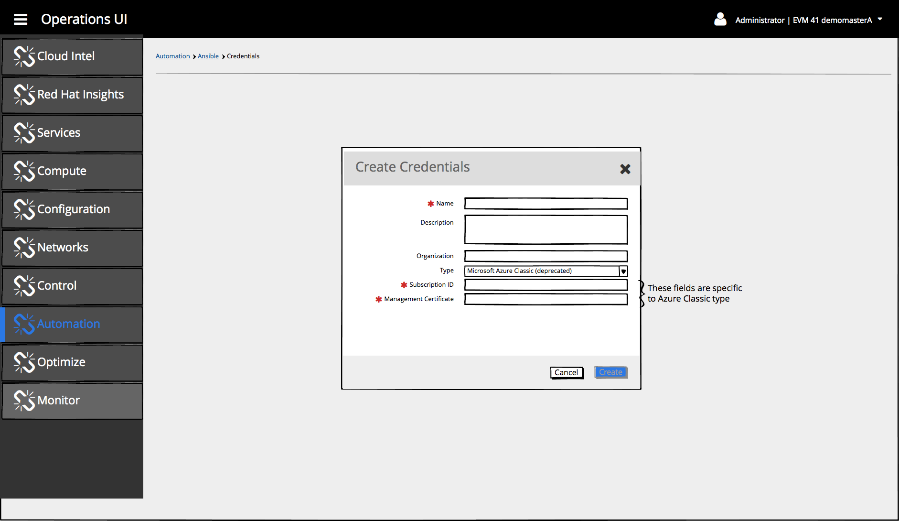

##### Microsoft Azure Resource Manager Cloud Credentials
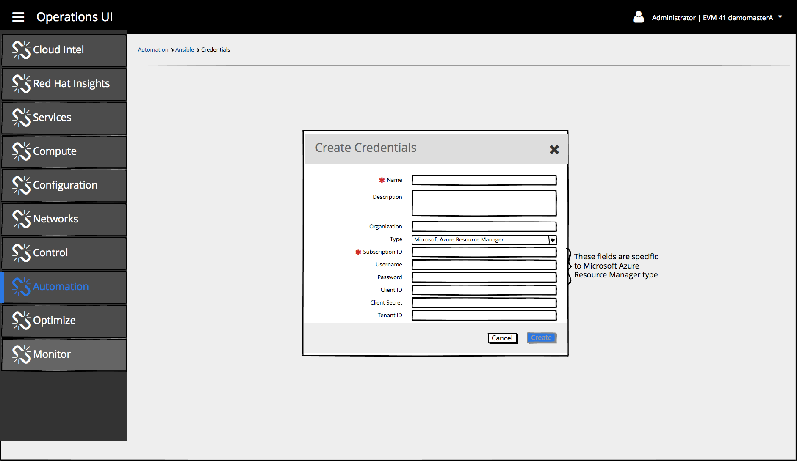

##### OpenStack Cloud Credentials
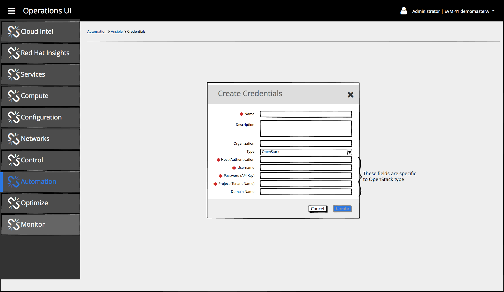

##### Rackspace Cloud Credentials

##### Red Hat CloudForms Cloud Credentials

##### Red Hat Satellite 6 Cloud Credentials
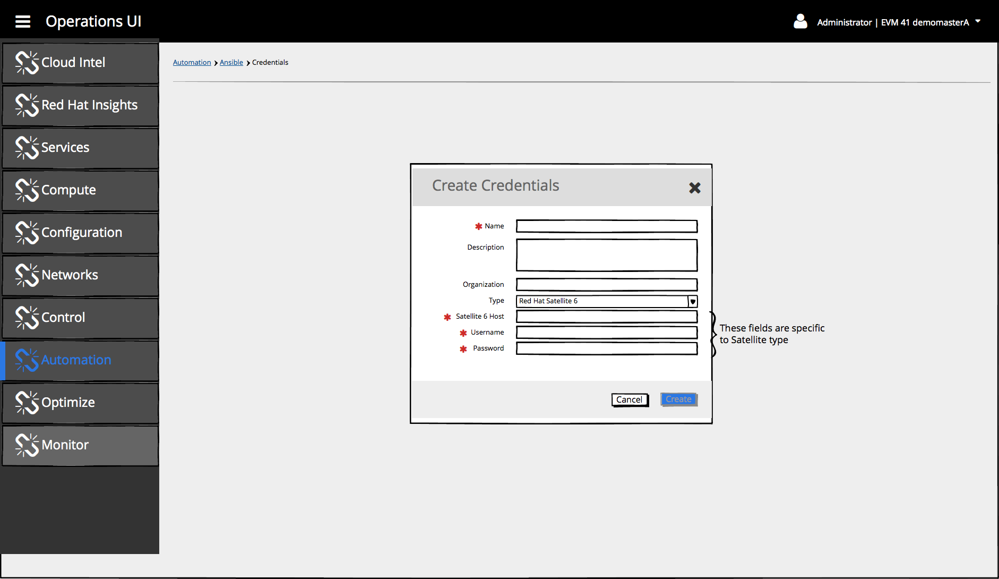

##### VMware vCenter Cloud Credentials

##### Machine Credentials

##### Network Credentials
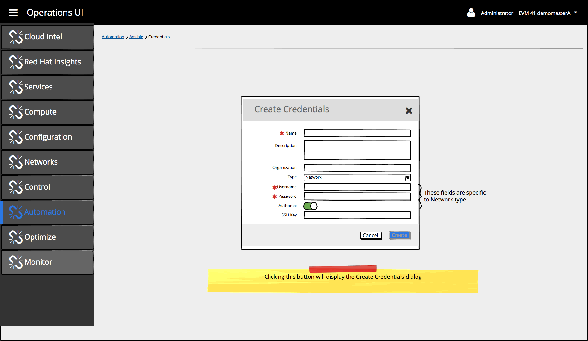

#### Edit Credentials
tbd

#### Delete Credentials
tbd

## Ansible Playbooks
The Playbooks page includes:
- **Breadcrumb bar:** Automation > Ansible > Credentials
- **Table view:**
  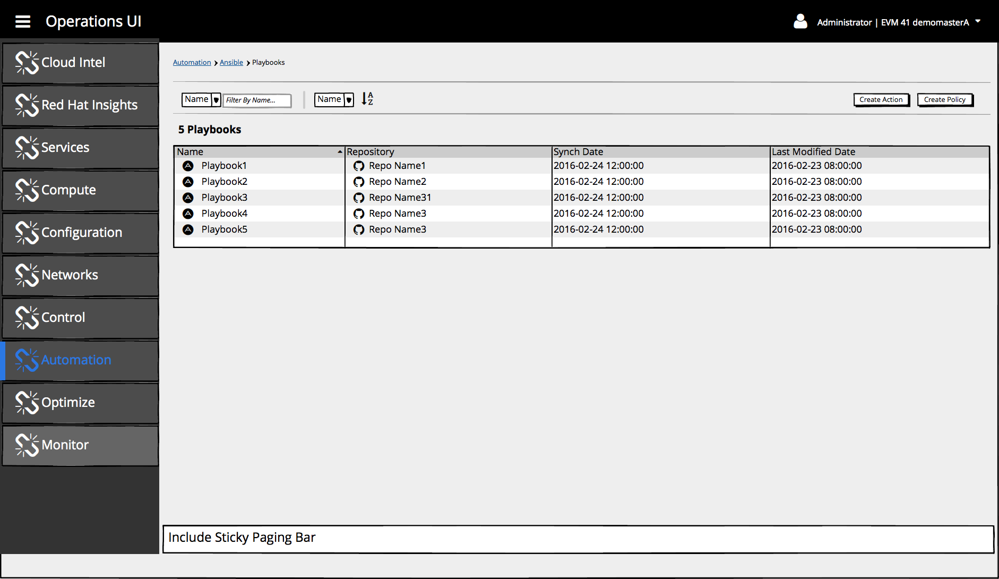

  The table includes the following columns:
  - **Name:**
  - **Repository:**
  - **Synch Date:**
  - **Last Modified Date:**

  Filtering is supported on the following fields:
  - Name (default)
  - tbd

  Sorting is supporting on the following fields:
  - Name (default)
  - tbd

- When no Ansible Playbooks exist, use the PatternFly Empty State Pattern
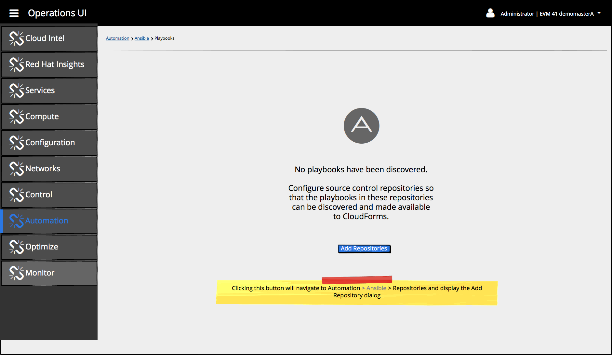

### Available Actions

## Ansible Repositories

The Repositories page includes
- **Breadcrumb bar:** Automation > Ansible > Repositories
- **Table view:**
  

  The table includes the following columns:
  - **Name:**
  - **URL:**
  - **# of Playbooks:**
  - **Synch Date:**
  - **Last Modified Date:**
  - **Clean:**
  - **Delete on Update:**
  - **Update on Launch:**

  Filtering is supported on the following fields:
  - Name (default)
  - tbd

  Sorting is supporting on the following fields:
  - Name (default)
  - tbd

- When no repositories exist, use the PatternFly Empty State Pattern
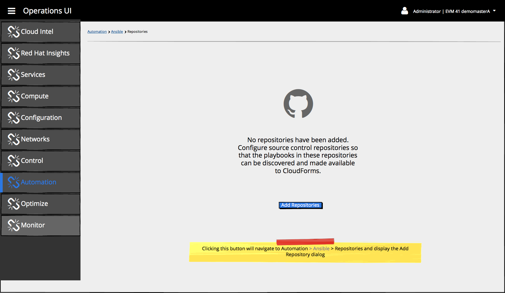

### Available Actions
1. [Add](ansible#add-repository)
2. [Edit](ansible#edit-repository)
3. [Remove](ansible#remove-repository)
4. [Synch](ansible#synch-repository)

#### Add Repository
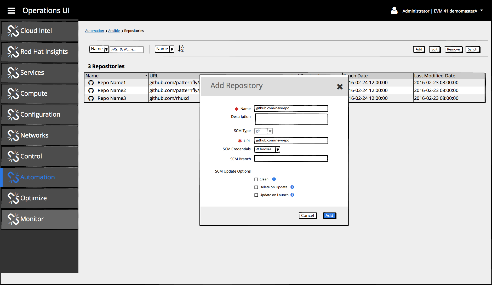

The following fields are available:
- **Name** (required):
- **Description:** Optional description associated with the repository
- **SCM Type:** For initial release, "git" is the only available value for SCM type, thus will be pre-selected and this field will be disabled
- **URL** (required): URL of the git repository
- **SCM Credentials:** SCM credentials to be used for this repository
- **SCM Branch:** Optional text area
- **SCM Update Options**
  - **Clean:** Checkbox indicating whether to use clean
  - **Delete on Update:** Checkbox indicating whether to use delete on update
  - **Update on Launch:** Checkbox indicating whether to use update on launch

Available buttons:
- **Cancel:**
- **Add:** This button should be disabled until required fields are input.

#### Edit Repository
tbd

#### Remove Repository
tbd

#### Synch Repository
tbd
