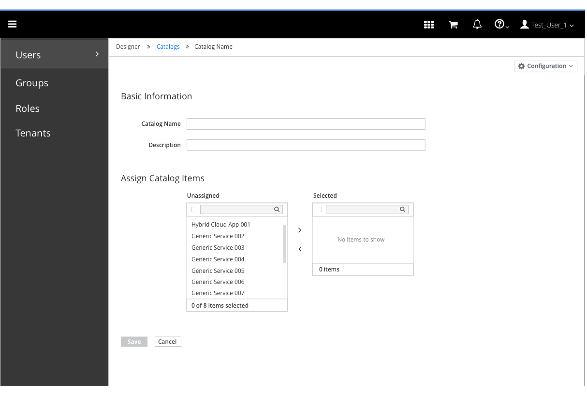
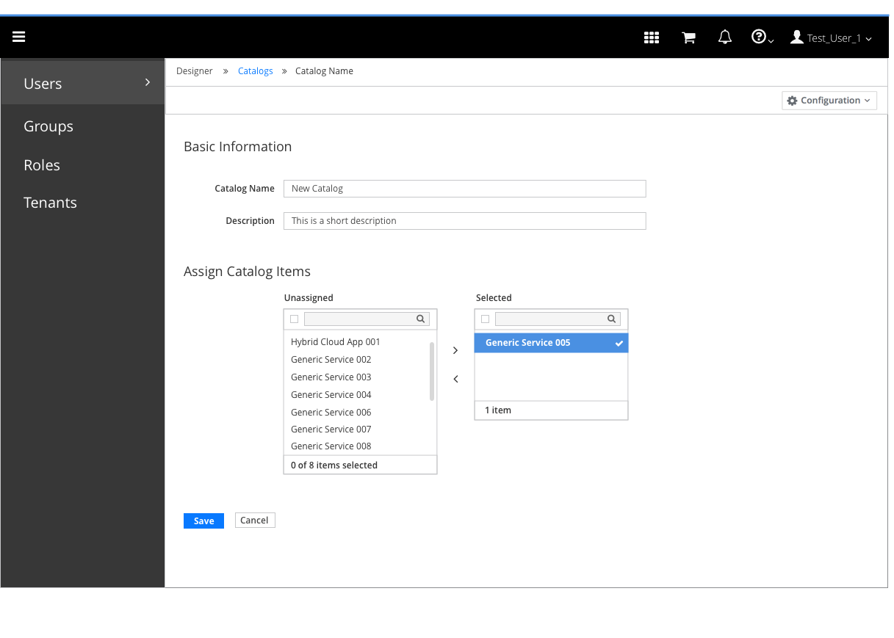

# Catalogs

- "Catalogs" are a secondary navigation item under designer.
- This area is for the service designer, and is not visible to the end user.
- This area is provided so the service designer can:
  - perform CRUD operations on catalogs.
  - organize their services in catalogs.

## View Existing Catalogs
- The default view is an expanded list view
- Eventually a table view should be offered, which is based off of the Angular PatternFly Table ( coming in 2017 with PF4 )

### View Catalog - List View

- Notes

#### Implementation Details
- Reference Angular PatternFly Expandable List View component

### View Catalog - Expanded List Item

- Expandable list view should display the details of the services inside the catalog.  The icon, name, description and dialog information should be available.
- Ideally we would like to be able to filter by service name.

### View Catalog - Dealing with Truncation

- For descriptions longer than the available text area, allow a hover to read the full description.  This should be followed for any fields that get cut off.

### View Catalog - Table View
- to be designed

#### Implementation Details
- Reference Angular PatternFly Table component (tbd)

## Catalog Actions

- The Configuration button group which is available in the Operations UI should be supported in the Service UI
- The button group should be available based on roles
- Available catalog actions are: Create, Edit and Delete
- Create should always be enabled
- Edit should only be enabled if a single item is selected
- Delete should be enabled if one or more catalogs are selected

## Create Catalog

### Accessing Create

- The Create action menu is available in the Configuration button group
- Create should always be enabled

#### Implementation Details
- Note that this is not yet a part of PatternFly - we may want to look into getting support

### Create Catalog Flow

- The create flow is accomplished in a page, not in a modal
- Include a breadcrumb on the page
- Services should be assigned to the catalog through a new design pattern, the dual pane selector

#### Implementation Details
- Use the [PatternFly proposed dual pane selector](https://github.com/patternfly/patternfly-design/pull/36).  This is a proposed design, with no implementation at this point.  Note that the initial implementation should not include filter/search/find

### Create Catalog

- As soon as all required fields are created, the Save button should be enabled

## Edit Catalog

### Accessing Edit

- The Edit action menu is available in the Configuration button group
- Edit should only be enabled if one catalog is selected

### Edit Catalog Flow

- The Edit Catalog flow is exactly the same as the Create flow, except that all required input is already input from the start, so the Save and Cancel buttons are disabled

- Once anything is modified, the Save and Cancel buttons should be enabled

## Delete Catalog

### Accessing Delete

- The Delete action menu is available in the Configuration button group
- Delete is enabled if one or more catalogs are selected

### Delete Confirmation Dialog

- A delete confirmation dialog should be issued

#### Implementation Details
- This delete confirmation dialog should conform to the proposed PatternFly design pattern.
