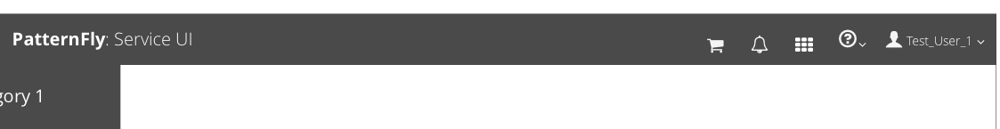
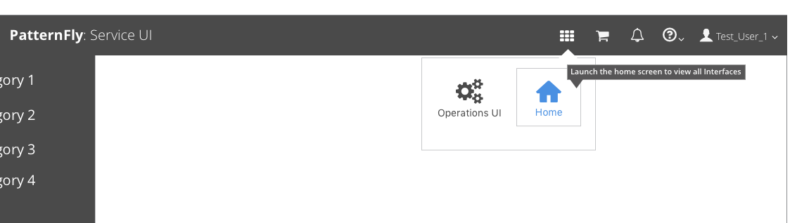
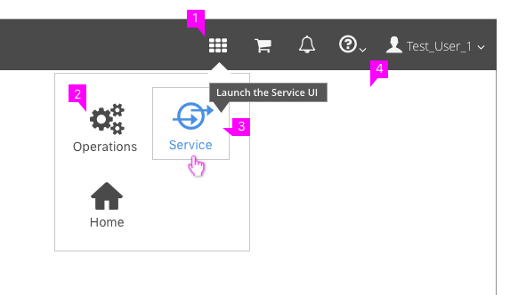

# Application Launcher

* The Application Launcher should be used when more than one interface is available.
* This widget makes it easier for the user to switch between different user interfaces without logging out.
* The Application Launcher should be accessible from the masthead.

## Properties

  1. **App Launcher Icon:** The "fa-th" icon from the Font Awesome icon library should be used to represent the Application launcher. Clicking on the icon will open a menu allowing the user to select a different interface to launch.  
  2. **Menu Items:**  The menu displays any available user interfaces (depending on permissions). The user interfaces are represented with a label (UI name) and associated icon. The current interface being used should not show up in the menu. The Home option should appear at the bottom of the list and should send the user to a generic landing page with all UI options and links to product documentation. If a user does not have access to any additional interfaces, the Application Launcher icon should be hidden from the masthead.
  3. **Selecting:** When a user hovers over the UI Name or Icon, both should be highlighted as links, with a button border appearing as well. Clicking the option will launch the selected UI in a new browser window or browser tab, based on the browser preferences of the user.
  4. **Tooltip:** As a user hovers over the UI Name or Icon, a [Tooltip](https://www.patternfly.org/pattern-library/widgets/#tooltip) should be available to explain what the action will do.
