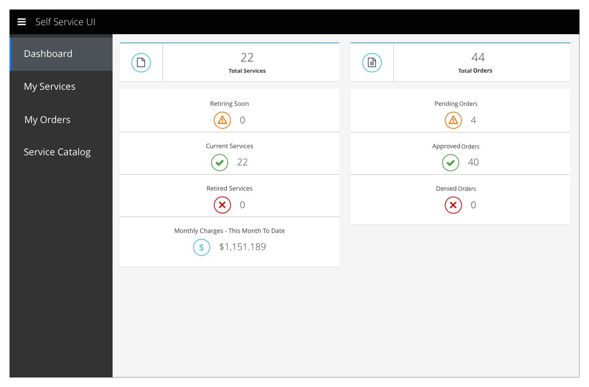

# Dashboard

- Dashboard is a primary navigation item
- The dashboard is visible to all users
- It provides easy-to-view, high-level information about the user's services and orders

## View Dashboard

### Dashboard

#### Implementation Details
  - The yellow, green, and red rows are missing 20px of padding along the bottom.

## Future Possibilities

### Dashboard

- Exact numbers of requests and services can be collapsed onto a single card
- If it is possible to store and retrieve past data, the dashboard should be updated to include trend information

### Implementation Details
  - Data that add up to a whole should be represented with either an area chart or a donut chart
    - When the data is useful for looking at historical trends, it should be displayed in an area chart.
    - When data is useful primarily because of its current state, it should be displayed in a donut chart.

## Customer Feedback

### Customer Feedback Received
  - Overview of customer feedback received

### Necessary Customer Feedback
  - Questions to follow up with customers
