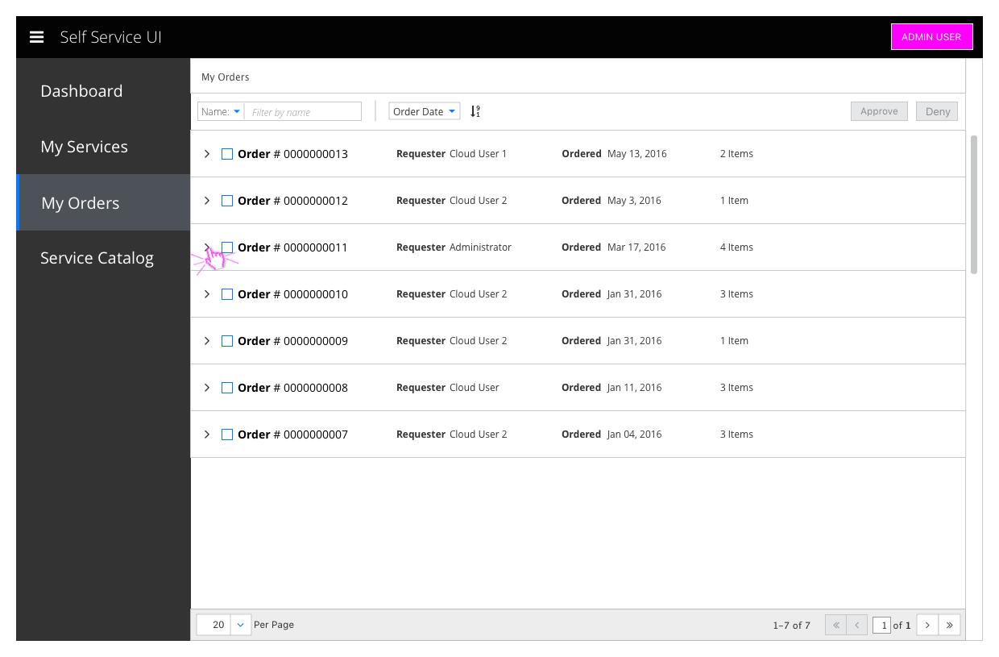
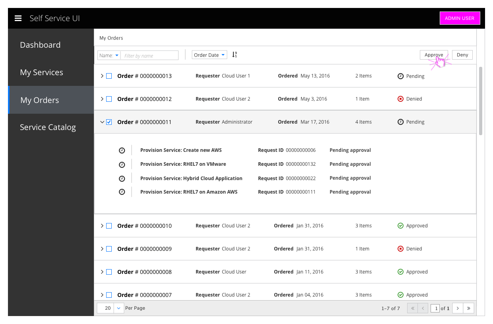
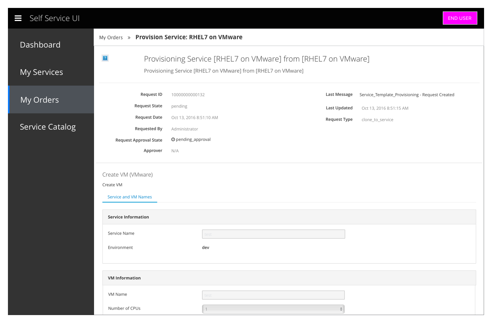

# My Orders

- My Orders is a primary navigation item
- Administrators
  - View and approve or deny orders for other users
- End Users
  - View status of placed orders

## Admin user

### Review Orders

- The Admin User sees all orders that have been placed.

### Approve Order

- The Administrator can check and approve an order or its component pieces

#### Implementation Details
  - The orders list should use the [List View with simple expansion](https://www.patternfly.org/pattern-library/content-views/list-view/#/api#expanding-rows) pattern

## End user

### View Orders

- The End User sees only orders that they have placed

### View Requests

- They can check the status of their currently pending orders and view all past orders and their component requests

### View Request

## Customer Feedback

### Customer Feedback Received
  - Overview of customer feedback received

### Necessary Customer Feedback
  - Questions to follow up with customers
