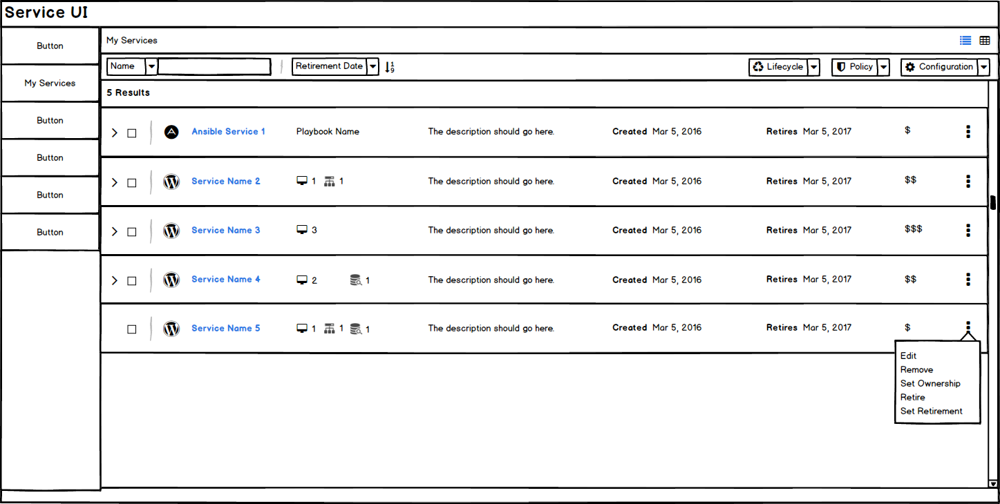
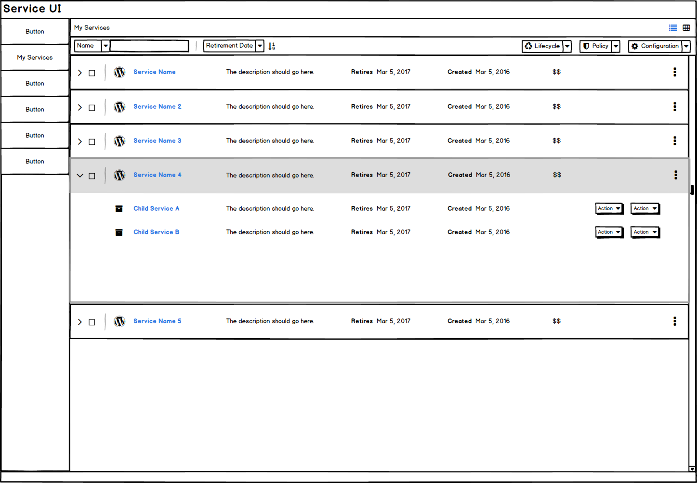
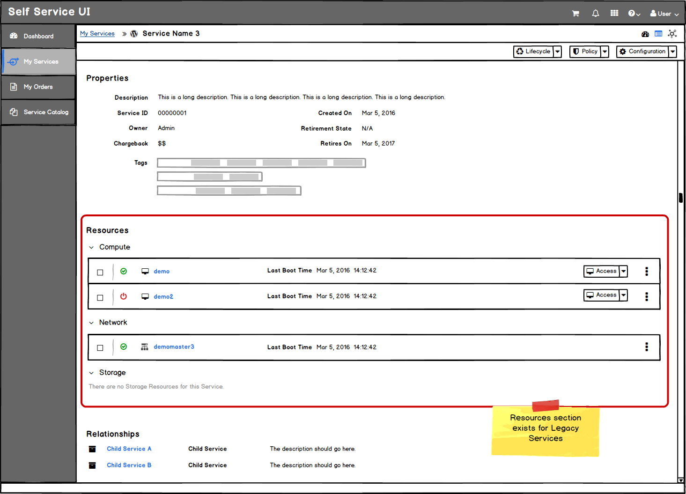
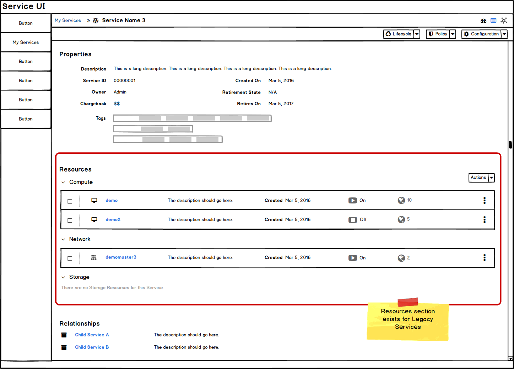
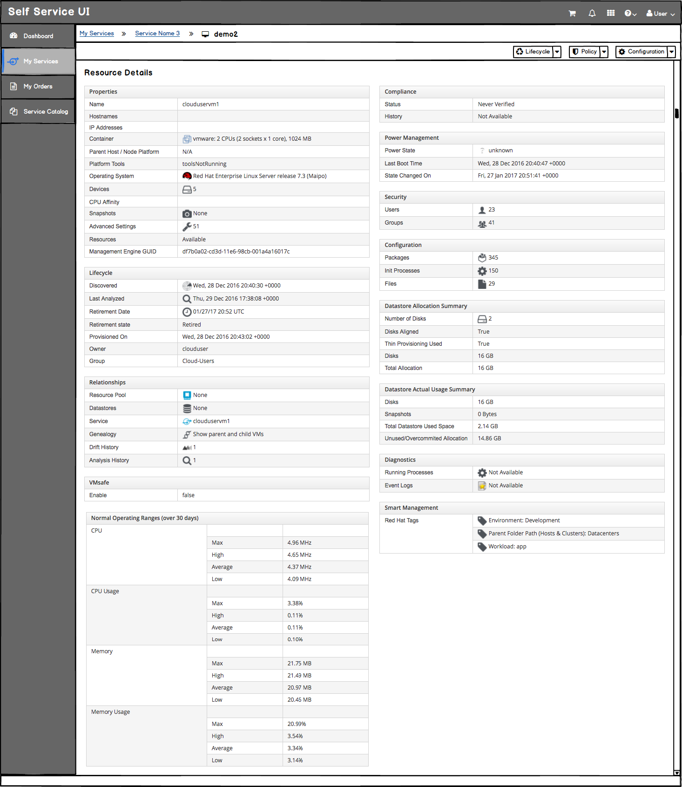
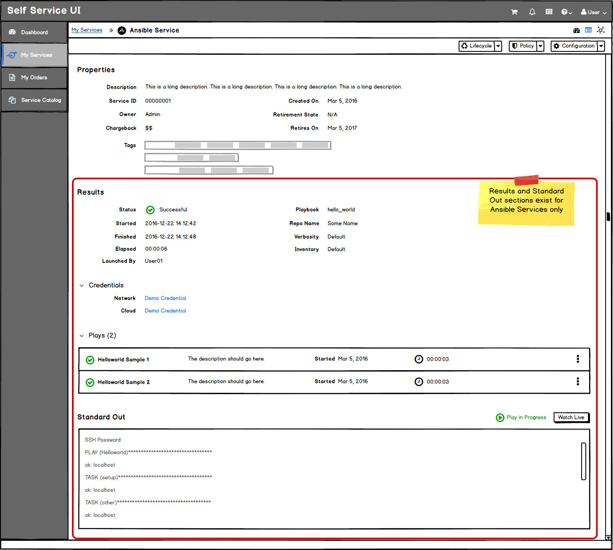
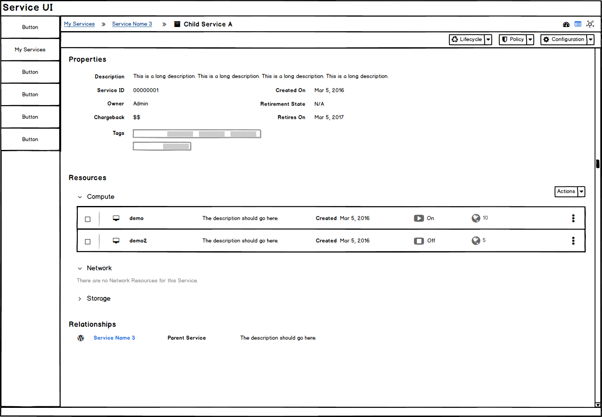
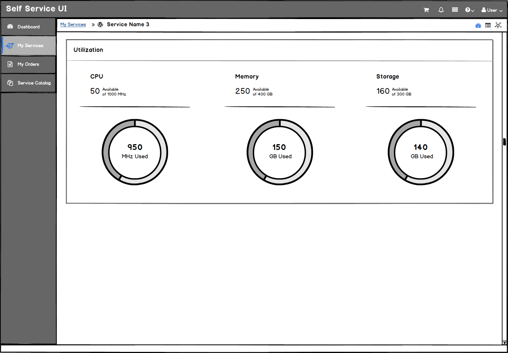

# My Services
* My Services are a primary navigation item.
* This area is for the end user
* This area is provided so the user can view the current state and details of their services.

## Table View
* A Table View is the secondary view that should be added once the PatternFly Angular Table is available. The table will show additional fields that may be missing from the List View.
* Bulk actions can be accessed through the button groups at the top of the list.

## List View
* A List View is the default view for My Services and it will not show all fields in this view.
* Bulk actions can be accessed through the button groups at the top of the list.

* The Service Names are links and will bring the user to a service details page.
* Resources will be shown for legacy services when a VM, Network, or Storage resource exists. For Ansible services, the playbook name should appear for this column instead.
* **Implementation Details:** Reference the Angular PatternFly Expandable List View Component.
* **Research:** Determine if the date should be called "Created" or "Ordered" in the list view.

## List View - Expanded Row

* Clicking anywhere on the row (aside from other links or buttons) will expand the row
* Child Services are listed in the expanded portion. If no Child Services exist for a particular service, expand should not work and the caret icon should be hidden for that row.
* Actions available for Child Services are TBD.
* Child Services are also links and will bring the user to the child service details page.

## Service Details (drilldown page)
* When a single service is chosen, the service details page will be loaded.
* The breadcrumbs will change to show My Services as a link back to the List View.
* The service details will include the following view types: summary view, utilization dashboard, and topology view. The default should be the Summary View.

### Service Details - Summary View
* The properties section at the top of the summary view will be consistent for ALL services.

* Properties will consist of general information, including tags. Utilization properties will be excluded from this section and will show up in the dashboard view instead.
* The next section of the summary view will vary depending on the type of service the user has selected. For legacy services there will be a resources section and for Ansible services there will be a Results section.

#### Service Details - Summary View - Legacy Services
* For legacy services, the next section under the properties will be the resources.

* Resources will be divided into sections or headings (Compute, Network, and Storage). Each section can expand and collapse, with a compact list view of resources underneath.

* Individual resources will be listed as links so users can drill down to a specific resource details view.

* **Research:** Determine actions available for resources. Should these be listed within the standard button groups?
* Relationships will be the next section after Resources. Child Services will be listed as links here and will bring the user to the Child Service Summary View.

#### Service Details - Summary View - Ansible Services
* For Ansible services, the next section under the properties will be the results and standard out.

* The Results section will have a basic set of information regarding the service, followed by a compact list view of plays.
* The Standard Out section will include a log of the most recent information available from the time the page was loaded. If the play is still in progress, a status will appear on the right, along with a button to "Watch Live" details of the play. This live version will be displayed in a modal.

#### Child Service - Summary View

* The breadcrumbs will change to show My Services and the Parent Service as links.
* The service details page will be in the same format as the Parent Service Detail page.

### Service Details - Dashboard View
* The dashboard view will display a utilization trend card with the CPU, Memory, and Storage data.

## Customer Feedback Received
  - Overview of customer feedback received
