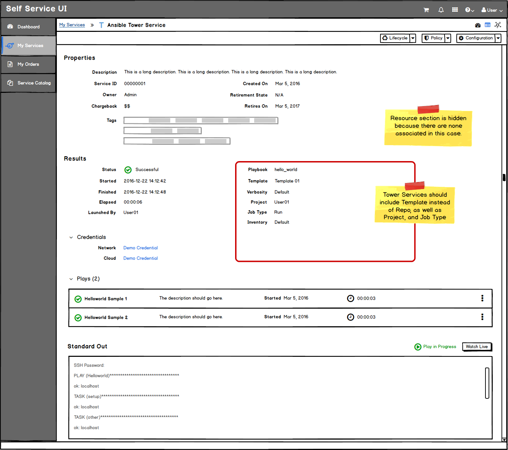

# My Services
* My Services are a primary navigation item.
* This area is for the end user
* This area is provided so the user can view the current state and details of their services.

## Table View
* A Table View is the secondary view that should be added once the PatternFly Angular Table is available. The table will show additional fields that may be missing from the List View.
* Bulk actions can be accessed through the button groups at the top of the list.

## List View
* A List View is the default view for My Services and it will not show all fields in this view.
* Bulk actions can be accessed through the button groups at the top of the list.
* Custom button groups will be added to the left of the standard button groups. To conserve space, the button group labels are removed in this view.
* All actions will also be available in the kebab menu for acting on a single service.

* The Service Names are links and will bring the user to a service details page.
* Resources will be shown for legacy services when a VM, Network, or Storage resource exists. For Ansible services, the playbook name should appear for this column instead and for Ansible Tower services, the template name should appear here.
* **Implementation Details:** Reference the Angular PatternFly Expandable List View Component.

## List View - Expanded Row

* Clicking anywhere on the row (aside from other links or buttons) will expand the row
* Child Services are listed in the expanded portion. If no Child Services exist for a particular service, expand should not work and the caret icon should be hidden for that row.
* Child Services are also links and will bring the user to the child service details page.

## Service Details (drilldown page)
* When a single service is chosen, the service details page will be loaded.
* The breadcrumbs will change to show My Services as a link back to the List View.
* The service details will include the following view types: summary view, utilization dashboard, and topology view. The default should be the Summary View.

### Service Details - Summary View
* Actions can be accessed through the button groups at the top of the page. Custom button groups will be added to the left of the standard button groups. Button labels should be included in this view.
* The following sections will be displayed on the summary view page:
  1. **Properties:**
      

    * The properties section at the top of the summary view will be consistent for ALL services.
    * Properties will consist of general information, including tags. Utilization properties will be excluded from this section and will show up in the dashboard view instead.

  2. **Resources** (optional):
    

    * Resources will be divided into sections or headings (Compute, Network, and Storage). Each section can expand and collapse, with a compact list view of resources underneath.
    * If no resources exist for a particular service, this section should be **hidden.**
    * The resources list view will have access control actions available for launching a console and all other resource actions will be listed under the kebab menu.
    * Individual resources will be listed as links so users can drill down to a specific resource details view.

    

  3. **Results** (optional):
    * This section is only displayed for Ansible and Ansible Tower services. For legacy services, this section should be hidden.

    

    * The Results section will have a basic set of information regarding the service, including a credentials section for machine credentials, network credentials, cloud credentials etc.
    * This basic set of information will include additional fields for Ansible Tower Services

    

    * The basic information is followed by a compact list view of plays from the most recent play.
    * The Standard Out section will include a log of the most recent information available from the time the page was loaded. If the play is still in progress, a status will appear on the right, along with a button to "Watch Live" details of the play. This live version will be displayed in a modal.  
  4. **Relationships:**
    * Child Services will be listed as links here and will bring the user to the Child Service Summary View.

    

    * The breadcrumbs will change to show My Services and the Parent Service as links.
    * The service details page will be in the same format as the Parent Service Detail page.

### Service Details - Dashboard View
* The dashboard view will display a utilization trend card with the CPU, Memory, and Storage data.

## Customer Feedback Received
  - Overview of customer feedback received
