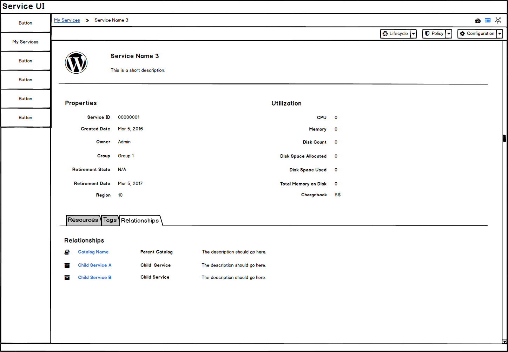

# My Services
* My Services are a primary navigation item.
* This area is for the end user
* This area is provided so the user can view the current state and details of their services.

## View My Services
* A List View is the default view for My Services and it will not show all fields in this view.
* A Table View is the secondary view that should be added once the PatternFly Angular Table is available. The table will show additional fields that may be missing from the List View.
* Bulk actions can be accessed through the button groups at the top of the list.

### List View

* The Service Names are links and will bring the user to a service details page.
* The exact List View fields to be included are TBD.
* **Implementation Details:** Reference the Angular PatternFly Expandable List View Component.

### List View - Expanded Row

* Clicking anywhere on the row (aside from other links or buttons) will expand the row
* Child Services are listed in the expanded portion. If no Child Services exist for a particular service, expand should not work and the caret icon should be hidden for that row.
* Actions available for Child Services are TBD.
* Child Services are also links and will bring the user to the child service details page.

### Service Details (drilldown page)
* When a single service is chosen, the service details page will be loaded.
* The breadcrumbs will change to show My Services as a link back to the List View.
* The service details will include the following view types: summary view, utilization dashboard, and topology view. The default should be the Summary View.

#### Service - Summary View

* The summary view will include the properties, resources, and relationships.
1. Properties: General information should be listed in this section. Tags should be included at the bottom of the list. Utilization properties will be excluded from this section and will show up in the dashboard view instead.
2. Resources: Resources will be divided into three headings, Compute, Network, and Storage. Each section can expand and collapse, with a compact list view of resources underneath. Actions are available on the right.
3. Relationships: Child Services will be listed as links and will bring the user to the Child Service Summary View.

#### Child Service - Summary View

* The breadcrumbs will change to show My Services and the Parent Service as links.
* The service details page will be in the same format as the Parent Service Detail page.

## Customer Feedback

### Customer Feedback Received
  - Overview of customer feedback received

### Necessary Customer Feedback
  - Questions to follow up with customers
