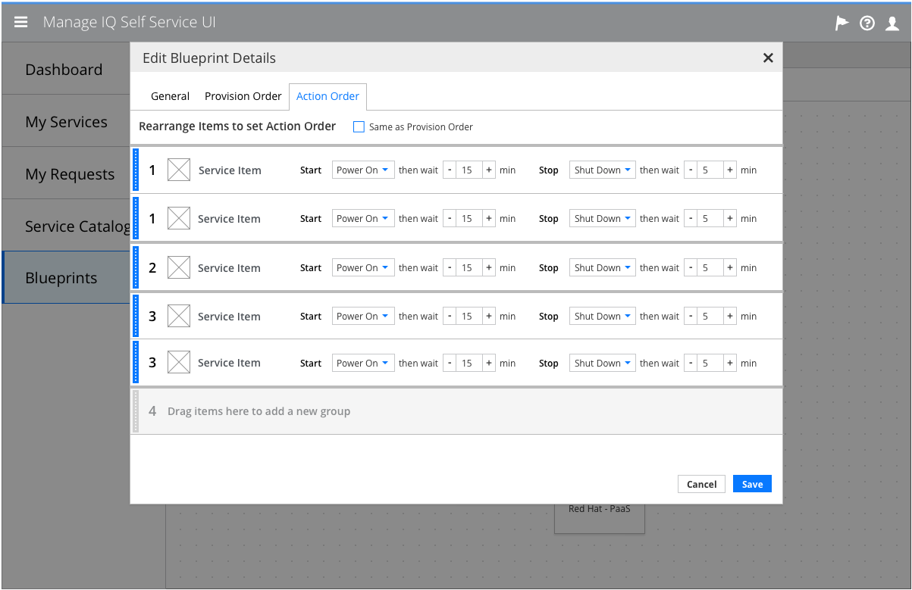
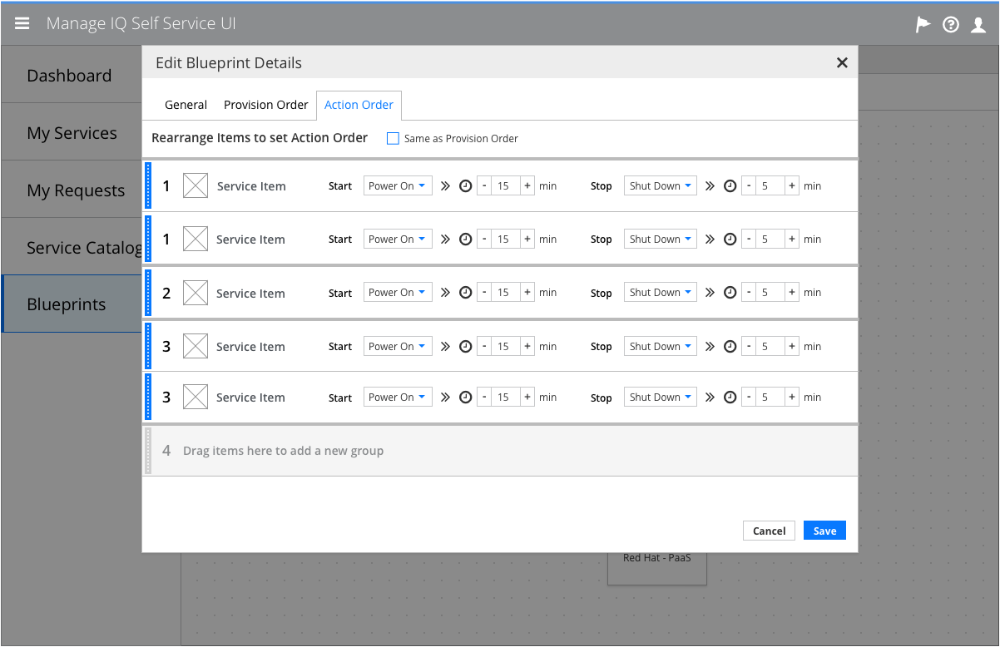

# Blueprint Details

- Blueprint Details is a modal available from the blueprint designer canvas
- This modal is for the service designer
- This modal is provided so the service designer can:
  - View and edit the details of the current blueprint
  - Set the provision and action orders of the current blueprint

## Set Actions and Delays

### Actions and Delays

  - Action order will include the ability to select the action that each item takes when it starts and stops, as well as the waiting period after performing that action.
  - Dragging an item across a divider will change its provision or action order to match the other items in the group.
  - Checking the “Same as Provision Order” box will automatically place action order items in the same order as the provision order, but leave them interactive. Dragging an action order item will uncheck the box.

#### Implementation Details
  - Action and provision order will adopt the [Drag and Drop](https://github.com/patternfly/patternfly-design/blob/master/pattern-library/forms-and-controls/drag-and-drop/design/design.md) PatternFly standards.

### Actions and Delays Alternate

  - If word widths become an issue when translated, an alternative symbol-based version could be used instead.

## Customer Feedback

### Customer Feedback Received
  - Overview of customer feedback received

### Necessary Customer Feedback
  - Questions to follow up with customers
