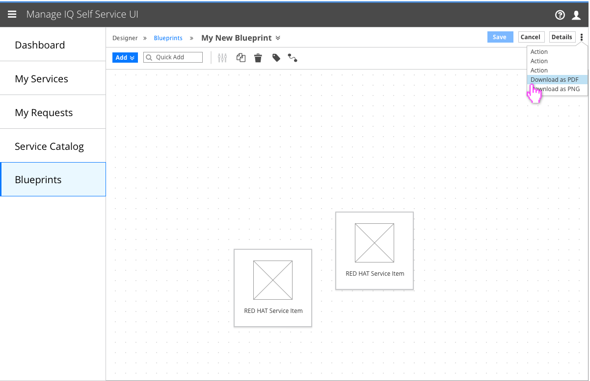
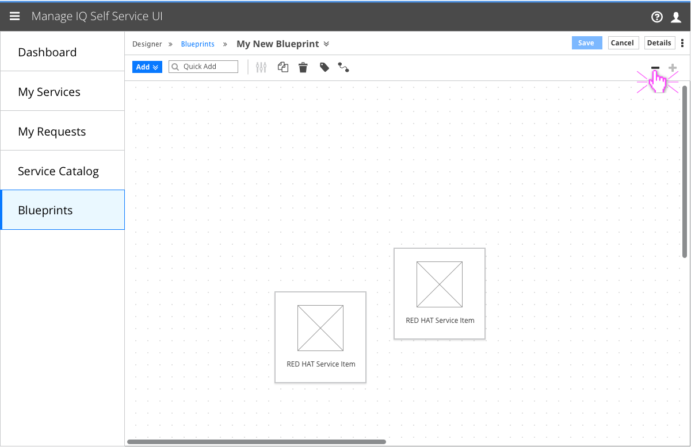
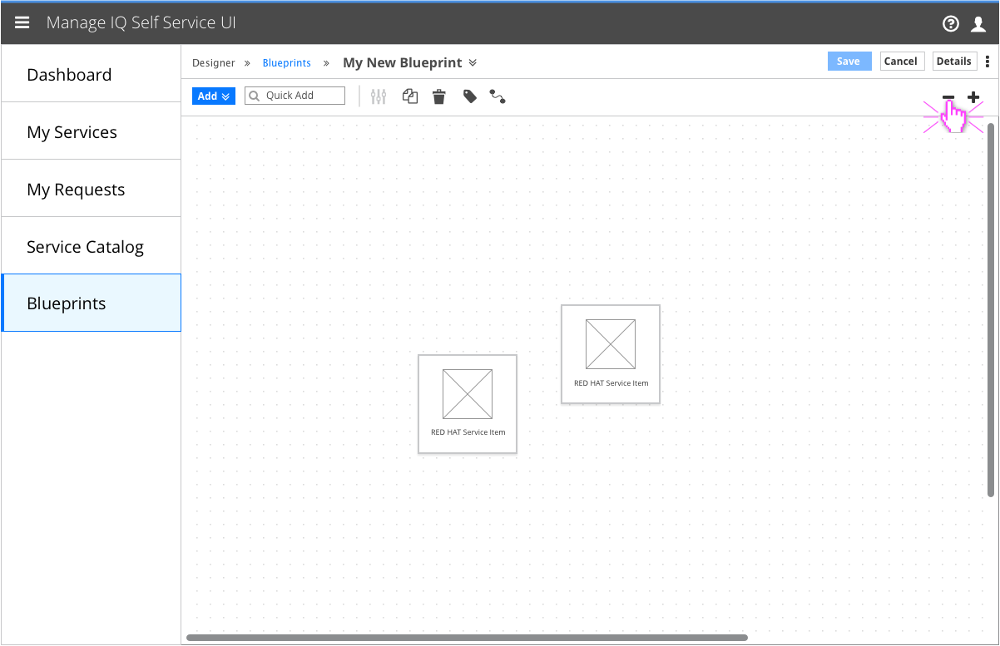
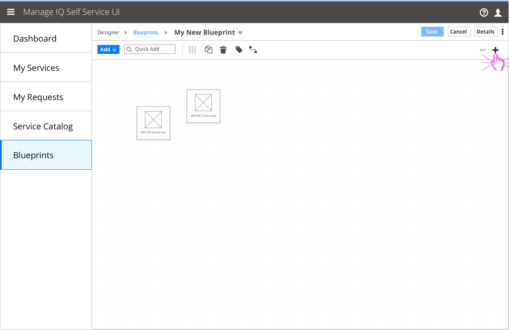
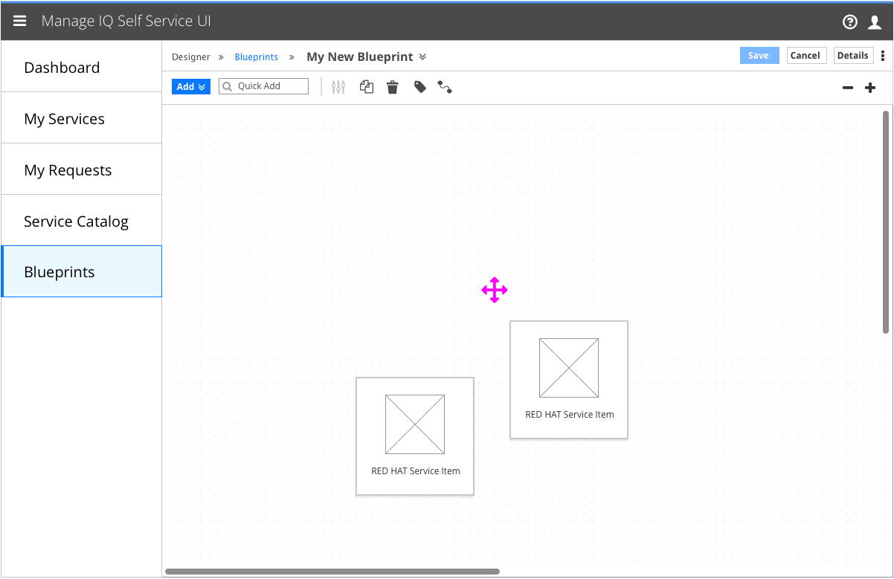
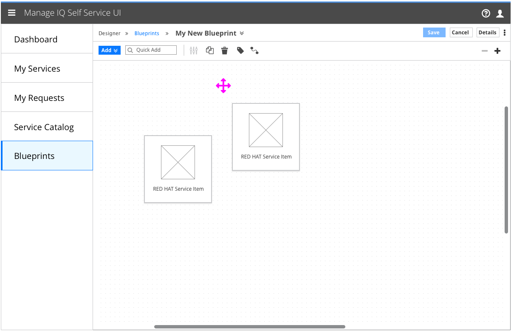

# Service Designer

- "xxx" are a secondary navigation item under xxx.
- This area is for the "a role", and is not visible to the "b role".
- This area is provided so the role can:
  - a
  - b

## Exporting the Canvas

  - Export/download options will be available in the project-level actions kebab.

#### Implementation Details
  - This feature will make use of the browser’s “downloads” section.
  - Downloads should be named according to the style “My_New_Blueprint.pdf”

## Pan/Zoom the Canvas

### Maximum Zoom

- Clicking on the - and + buttons will zoom the canvas out and in, respectively.
- The default zoom level will be considered 100% zoom. The + button is disabled at this zoom level.

#### Implementation Details
  - Icons
    - fa-plus
    - fa-minus

### 75% Zoom

- Clicking the button once will cause the canvas to transition to 75% of the original zoom level.

### 50% Zoom

- Zooming out a second time will redraw the canvas at 50% of the original size. This will be the most zoomed-out state of the canvas.

### Before Panning

#### Implementation Details
- When the canvas is not zoomed out all the way, hovering over the canvas background will change the mouse pointer to “cursor:all-scroll”.
- When it is zoomed out all the way, the cursor property will be set to “cursor: default”.

### After Panning

- Clicking and dragging on the canvas background when the cursor is in the all-scroll state will pan the canvas.

## Customer Feedback

### Customer Feedback Received
  - Overview of customer feedback received

### Necessary Customer Feedback
  - Questions to follow up with customers
